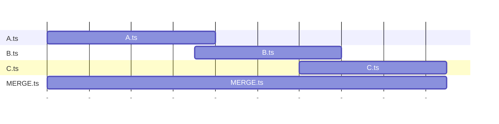

# TSMerge
A program that merges TS files by directly analyzing and removing overlapping binary data.

## Usage

```
Description:
  Merge MPEG-TS files into one

Usage:
  TSMerge <OUTPUT> [options]

Arguments:
  <OUTPUT>  File output name

Options:
  -i <FILE> (REQUIRED)  Add inputs
  -p <SIZE>             Pattern size to search (in MB) [default: 1]
  --version             Show version information
  -?, -h, --help        Show help and usage information
```

## Sample

```
TSMerge -i A.ts -i B.ts -i C.ts MERGE.ts
```

## Flowchart


